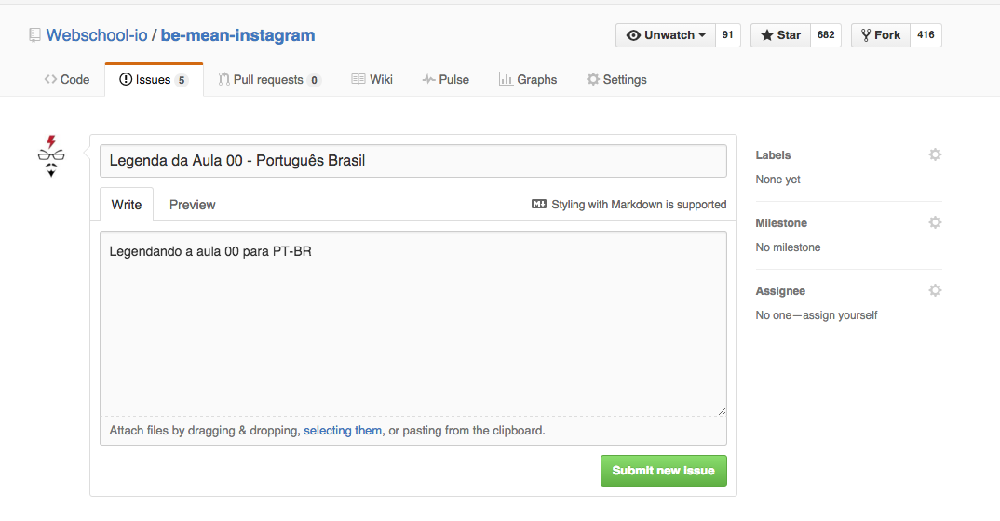

# Be MEAN Instagram - MongoDB - FAQ

## Qual o prazo dos Exercícios?

Você só precisa enviar **TODOS** os exercícios **antes de enviar seu PROJETO FINAL**, pois é obrigatório para receber o certificado.

## Qual o prazo dos Artigos?

Não há mais prazon final por entender que esse curso não possui datas finais para nada, logo não poderia ter para os artigos. Ainda mais por ter tido um **ótimo feedback** dos alunos que fizeram e falaram que **aprenderam PRA CARALEO**, é por isso que espero que a maioria dos alunos também faça pois **ele irá provar se você sabe o mínimo de JavaScript**, pois eles **serão listados no seu Currículo** como aluno da Webschool, que servirá para nosso Sistema de Jobs.

## Projeto Final

Será passado na **ÚLTIMA AULA** ainda essa semana!!

### Prazo

**Não possui prazo final!! Você só precisa ter visto todas as aulas, seu LIKE no vídeo confira sua "presença", e ter entregue todos os exercícios.** 

## Legendas das aulas

### Adesivos

Caso você queira contribuir com a disseminação desse conteúdo e queira legendar uma aula terá que primeiramente traduzir para o Português, com isso você já ganhará uns adesivos a sua escolha, para depois traduzir para outra língua.

### Camisetas

Você traduzindo a legenda do Português, ou outra língua, para alguma que ainda não tenha sido traduzida, você ganhará 1 camiseta a sua escolha **POR AULA**.

### Tradução

Antes de começar a traduzir por favor crie uma [Issue](https://github.com/Webschool-io/be-mean-instagram/issues/new) e preencha dessa forma.

